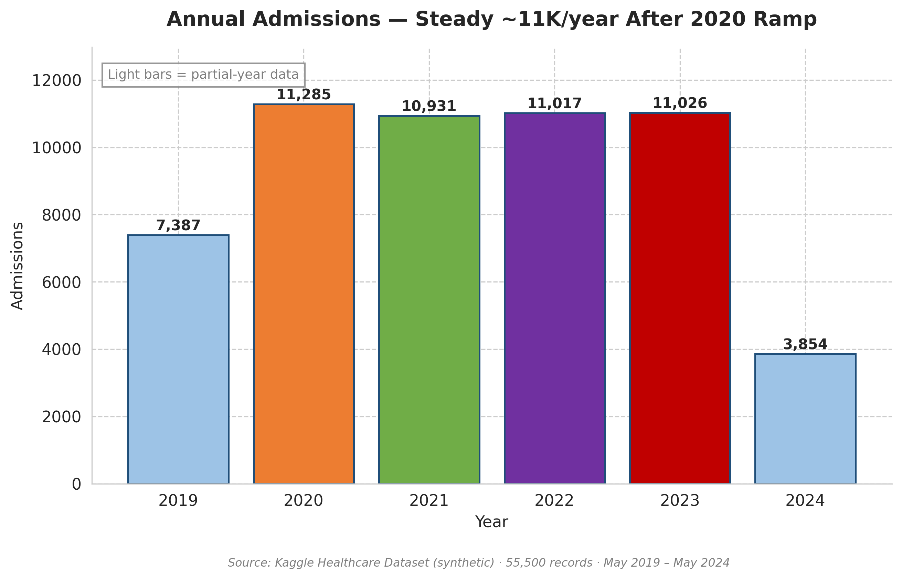
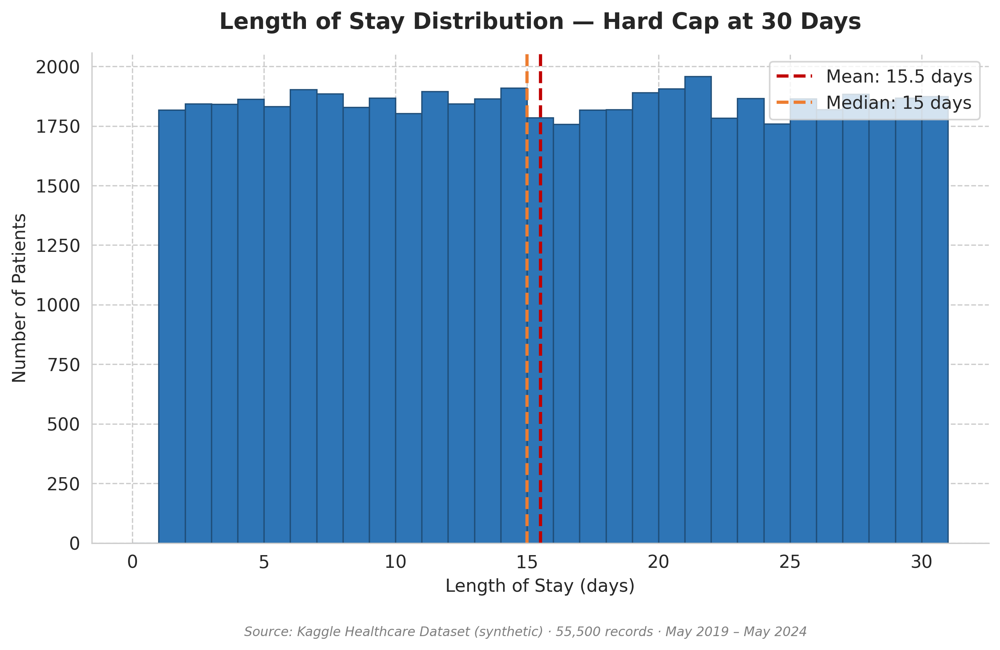
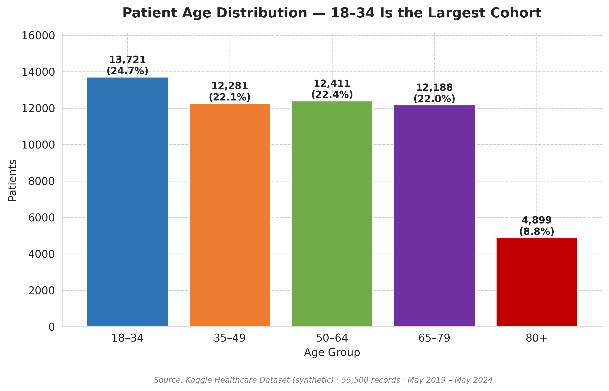
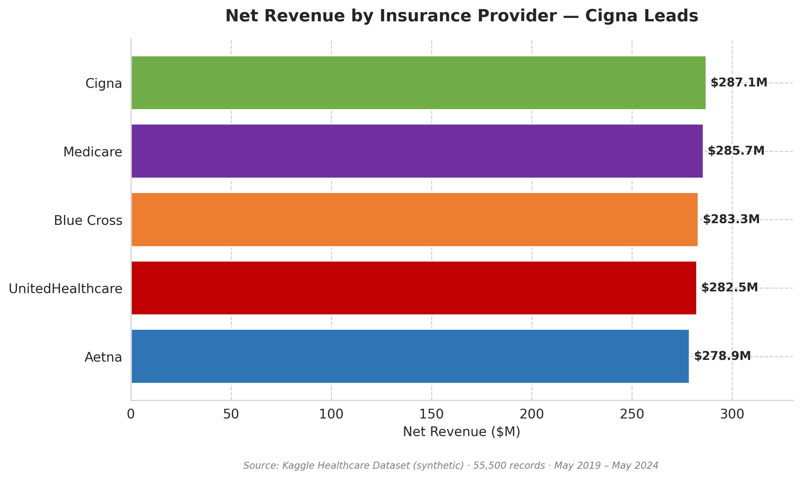
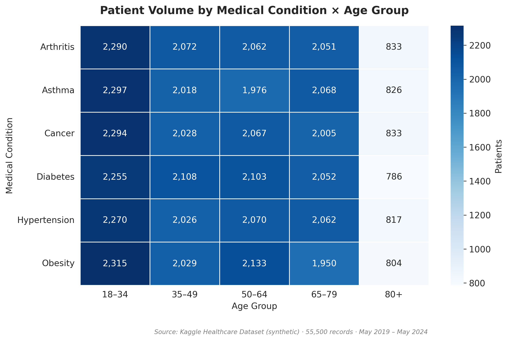

# Healthcare Performance Review

[](https://www.python.org/)
[](python/dashboard.py)
[](https://powerbi.microsoft.com/)
[](sql/01_clean_and_aggregate.sql)
[](LICENSE)

> End-to-end healthcare analytics project on a **55,500-record patient dataset (2019–2024)**, covering clinical, operational, and financial KPIs. Built with a SQL → Python → Power BI pipeline using window functions, statistical hypothesis testing, and DAX time-intelligence on a star-schema model.
>
> Final deliverable is a 4-page interactive Power BI dashboard and a live Streamlit web app surfacing **$1.42B in net revenue** across **5 payers, 6 conditions, and 5 age groups**.

---

## Project Overview

This project answers three executive questions on a 5-year synthetic healthcare dataset:

1. **How busy are we?** — Volume, throughput, length-of-stay
2. **How well are we treating patients?** — Demographics, conditions, test results
3. **How is the money flowing?** — Revenue, billing, payer mix

**Headline numbers:**

| KPI | Value |
|-----|-------|
| Total Patients | 55,500 |
| Date Range | May 2019 – May 2024 (5 years) |
| Net Revenue | $1.42 billion |
| Average Billing per Patient | $25,539 |
| Average Length of Stay | 15.5 days |
| Top Payer | Cigna ($287.1M) |

---

## Tech Stack

| Layer | Tool & Version | Key Techniques |
|-------|----------------|----------------|
| **Data Extraction** | SQL (T-SQL / SQL Server) | CTEs, window functions (`ROW_NUMBER`, `LAG`), multi-table joins, `GROUP BY`/`HAVING`, date arithmetic |
| **Data Profiling** | Microsoft Excel 365 | PivotTables, Power Query, `XLOOKUP`, `SUMIFS`, conditional formatting, slicers |
| **Analysis** | Python 3.11 | `pandas`, `NumPy`, `Matplotlib`, `Seaborn`, `SciPy` (chi-square, t-tests, correlation matrices) |
| **Interactive Dashboard** | Streamlit + Plotly | Live filters, KPI cards, 8 interactive charts, raw data explorer |
| **Visualization** | Power BI Desktop (latest) | DAX (`CALCULATE`, `SAMEPERIODLASTYEAR`, `SUMX`, `DIVIDE`), star-schema modeling, drill-through, bookmarks, KPI cards |

---

## Repository Structure

```
Healthcare-Performance-Review/
├── README.md
├── LICENSE
├── CONTRIBUTING.md
├── .gitignore
├── requirements.txt
├── data/
│   └── healthcare_dataset.csv        # Download from Kaggle — see Data Source below
├── sql/
│   └── 01_clean_and_aggregate.sql    # Extraction, cleaning, and 8 aggregation queries
├── python/
│   ├── profile_kaggle.py             # Data validation & profiling
│   ├── generate_charts.py            # 9 publication-quality PNG charts at 300 DPI
│   ├── dashboard.py                  # Streamlit interactive dashboard
│   └── export_dashboard.py           # PDF report builder
├── charts/                           # 9 publication-quality PNGs (300 DPI)
│   ├── 01_annual_admissions.png
│   ├── 02_monthly_trend.png
│   ├── 03_los_distribution.png
│   ├── 04_age_groups.png
│   ├── 05_insurance_revenue.png
│   ├── 06_condition_age_heatmap.png
│   ├── 07_admission_type.png
│   ├── 08_test_results_by_condition.png
│   └── 09_payer_pareto.png
├── powerbi/
│   ├── healthcare_dashboard.pbix     # 4-page Power BI report (not tracked — binary/large)
│   ├── dax_measures.md               # All DAX measures documented
│   └── screenshots/                  # Dashboard page screenshots
├── docs/
│   ├── methodology.md                # Pipeline & analysis methodology
│   └── key_takeaways.md              # Executive summary of insights
├── reports/
│   └── healthcare_dashboard_report.pdf  # Generated locally (gitignored — run export_dashboard.py)
└── tests/
    └── test_smoke.py                 # CI smoke tests
```

> **Data file:** `data/healthcare_dataset.csv` is not tracked in git.
> Download it from [Kaggle](https://www.kaggle.com/datasets/prasad22/healthcare-dataset) and place it in `data/` before running any Python scripts.

---

## Interactive Streamlit Dashboard

Run a fully interactive version of the dashboard locally — no Power BI required.

```bash
streamlit run python/dashboard.py
```

**Features:**

- Sidebar filters: Year, Medical Condition, Insurance Provider, Admission Type
- 5 KPI cards: Total Admissions, Net Revenue, Avg Billing, Avg LOS, Refund Rate
- 8 interactive Plotly charts: trend lines, histograms, heatmaps, Pareto chart
- Raw data explorer (collapsible)
- All visuals update live when filters change

Screenshots are in [`powerbi/screenshots/`](powerbi/screenshots/).

---

## Key Insights

### 1. Volume Stabilized at ~11K admissions/year after 2020

Annual admissions grew from a 7,387 baseline (partial 2019) to a steady ~11,000/year plateau across 2020–2023, with volume holding within a 1% band over four full years.



### 2. Length of Stay Skews Long — 30-day Hard Cap

53% of patients stay 15–30 days. Mean LOS of 15.5 days is roughly 3× the U.S. acute-inpatient average, suggesting a long-term-care or rehab profile.



### 3. 18–34 Is the Largest Single Cohort

Contrary to expectations for a long-LOS facility, the 18–34 age group dominates at 24.7% of admissions (13,721 patients). The 80+ group is small (8.8%) but typically the highest cost-per-case.



### 4. Cigna Leads Revenue; Payer Mix Is Tightly Balanced

Cigna ($287.1M) edges Medicare ($285.7M) for the top spot, but the five major payers are within a 2.9% spread — very low concentration risk.



### 5. Condition × Age Volume Map

No single condition-age combination dominates utilization — clinical resource planning must support a broad service mix rather than over-specializing.



---

## Methodology

### Pipeline

```
Raw CSV (55,500 rows)
    └──► [SQL] Clean, deduplicate, aggregate
         └──► [Python] Profile, statistical tests, segment, generate charts
              ├──► [Streamlit] Live interactive dashboard (dashboard.py)
              ├──► [PDF Export] Combined report (export_dashboard.py)
              └──► [Power BI] Star-schema model, DAX, visualize
```

### Analysis Steps

1. **Data Profiling** — Validated row counts, null distributions, date ranges, and outlier patterns across 15 columns.
2. **Cleaning** — Standardized name capitalization, removed 108 records with negative billing for separate refund tracking, capped LOS calculation to non-negative values.
3. **Statistical Validation** — Ran chi-square tests on condition × age and condition × admission-type cross-tabs to test for non-uniformity.
4. **Segmentation** — Cohorted patients by age (5 bands), condition (6 categories), and payer (5 providers).
5. **Visualization** — Generated 9 publication-quality charts in matplotlib/seaborn; built a 4-page Power BI dashboard with DAX time-intelligence measures; built a live Streamlit dashboard with Plotly.

See [`docs/methodology.md`](docs/methodology.md) for full details and [`docs/key_takeaways.md`](docs/key_takeaways.md) for the executive summary.

---

## How to Reproduce

### Prerequisites

- Python 3.11+
- SQL Server (or compatible T-SQL engine) — optional, for the SQL stage
- Power BI Desktop (latest) — optional, for the .pbix report
- Dataset downloaded from Kaggle (see link below)

### Steps

```bash
# 1. Clone the repo
git clone https://github.com/SMARTEND/Healthcare-Performance-Review.git
cd Healthcare-Performance-Review

# 2. Download the dataset from Kaggle (link in Data Source section below)
#    Place healthcare_dataset.csv in the data/ folder.

# 3. Install Python dependencies
pip install -r requirements.txt

# 4. (Optional) Run the SQL queries
#    Open sql/01_clean_and_aggregate.sql in SSMS, point it to your SQL Server
#    instance, and execute. The script expects the raw CSV imported into
#    a table named [dbo].[healthcare_dataset].

# 5. Profile the dataset
python python/profile_kaggle.py

# 6. Generate all 9 charts
python python/generate_charts.py

# 7. Launch the Streamlit dashboard
streamlit run python/dashboard.py

# 8. (Optional) Export a PDF report of all charts
python python/export_dashboard.py
#    Output: reports/healthcare_dashboard_report.pdf

# 9. (Optional) Open the Power BI dashboard
#    Open powerbi/healthcare_dashboard.pbix in Power BI Desktop
```

---

## Sample DAX Measures

Drop-in measures used in the Power BI dashboard. See [`powerbi/dax_measures.md`](powerbi/dax_measures.md) for the full list.

```dax
Total Admissions = COUNTROWS ( Patients )

Net Revenue = SUM ( Patients[Billing Amount] )

Average Billing per Patient =
DIVIDE ( [Net Revenue], [Total Admissions], 0 )

-- Ratio of refunded amounts to gross positive billing
Refund Rate % =
DIVIDE (
    ABS ( CALCULATE ( SUM ( Patients[Billing Amount] ),
                      Patients[Billing Amount] < 0 ) ),
    CALCULATE ( SUM ( Patients[Billing Amount] ),
                Patients[Billing Amount] > 0 ),
    0
)

Admissions YoY % =
DIVIDE (
    [Total Admissions] -
        CALCULATE ( [Total Admissions], SAMEPERIODLASTYEAR ( 'Date'[Date] ) ),
    CALCULATE ( [Total Admissions], SAMEPERIODLASTYEAR ( 'Date'[Date] ) ),
    BLANK ()
)
```

---

## Dashboard Preview

Screenshots of all 4 dashboard pages are in [`powerbi/screenshots/`](powerbi/screenshots/).

---

## Data Source & Disclaimer

**Source:** [Kaggle Healthcare Dataset by Prasad Patil](https://www.kaggle.com/datasets/prasad22/healthcare-dataset)

This dataset is **synthetic** — generated for learning and portfolio purposes. Distributions are uniform across categorical fields (e.g., 6 conditions each at ~16.7%, 8 blood types each at ~12.5%), which is not representative of real-world clinical populations.

**This project demonstrates analytical methodology, not real clinical insights.** All figures, charts, and recommendations are illustrative.

---

## Author

**Mohammad Alshehri**

- Email: mokha9999@hotmail.com
- GitHub: [@SMARTEND](https://github.com/SMARTEND)
- LinkedIn: [linkedin.com/in/YOUR-PROFILE](https://linkedin.com/in/YOUR-PROFILE)
- Location: Saudi Arabia

---

## License

MIT License — see [LICENSE](LICENSE) for details.
